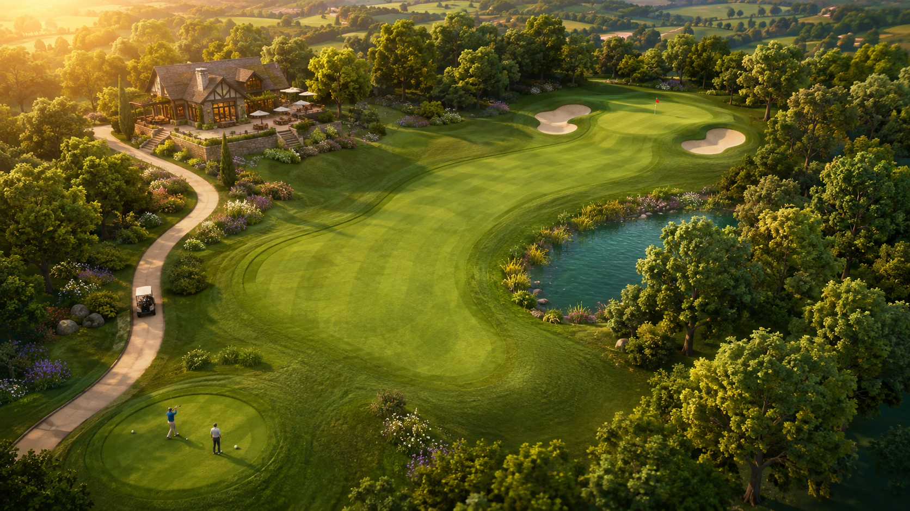
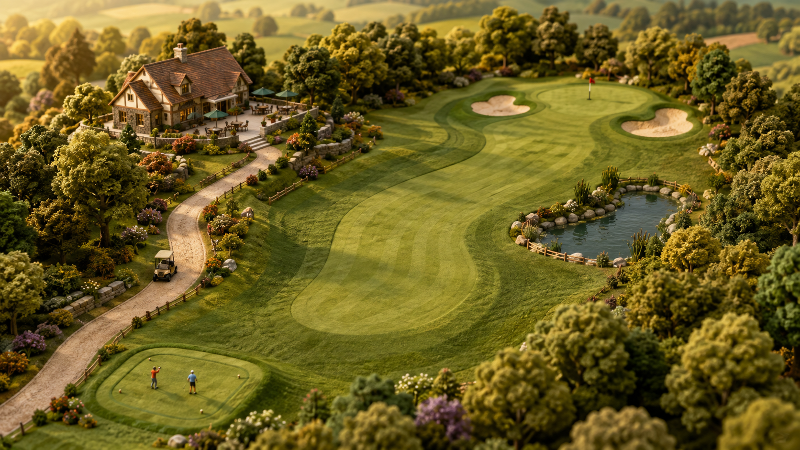
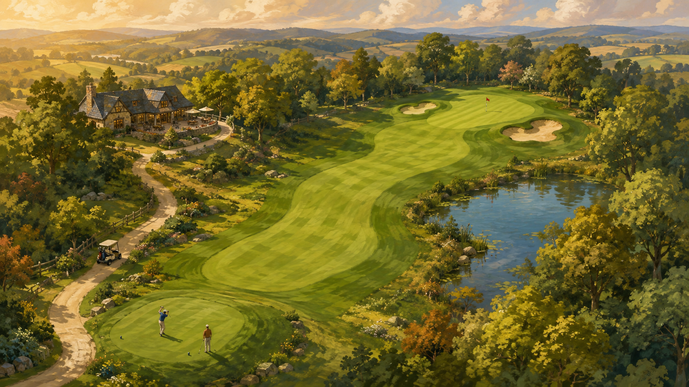

# One-hole art direction concepts

Generated with the built-in image_gen tool. These are concept images, not Godot renders or playable scenes. All three prompts use the same layout and camera brief; generated details vary.

## lush-resort

### Prompt

Use case: stylized-concept. Asset type: one-hole golf resort management game art-direction mock for Hole in Fun. Create a polished landscape 16:9 image, an elevated three-quarter management-camera view with the entire single playable par-4 hole clearly visible and useful terrain readability, not a ground-level marketing vista. Consistent comparison layout: tee in lower left foreground; broad organically curving fairway bending gently through center towards one putting green at upper right; one red pin on green; two irregular sand bunkers flanking green; small pond on right side of middle fairway; curving cream gravel cart path on left leading to a modest clubhouse and small terrace at upper left; clustered deciduous trees enclosing hole; two tiny golfers near tee and one cream golf cart on path. Landscape fills frame with countryside beyond, no floating island. Warm late-afternoon light from upper left. Natural smooth ground contours, crisp readable fairway/rough boundaries, aesthetically designed planting. No low-poly faceting, no blocky grid, no giant buildings, no extra holes, no text, no UI, no watermark. This is a plausible aspirational game art mock, not a photo of a real course. Art direction: LUSH STYLIZED RESORT. Premium contemporary stylized 3D game rendering, believable scale, lush layered softly rounded tree canopies with readable leaf clusters, subtle natural grass texture and restrained mowing stripes, rich olive/emerald greens, warm sandstone and timber clubhouse, soft contact shadows and atmospheric depth, rippled teal pond with reeds, rounded detailed geometry. Inviting and vivid but refined, not photorealistic, not toy plastic, no outlines. The terrain and materials should feel alive and grounded.

## miniature-world

### Prompt

Use case: stylized-concept. Asset type: one-hole golf resort management game art-direction mock for Hole in Fun. Create a polished landscape 16:9 image, an elevated three-quarter management-camera view with the entire single playable par-4 hole clearly visible and useful terrain readability, not a ground-level marketing vista. Consistent comparison layout: tee in lower left foreground; broad organically curving fairway bending gently through center towards one putting green at upper right; one red pin on green; two irregular sand bunkers flanking green; small pond on right side of middle fairway; curving cream gravel cart path on left leading to a modest clubhouse and small terrace at upper left; clustered deciduous trees enclosing hole; two tiny golfers near tee and one cream golf cart on path. Landscape fills frame with countryside beyond, no floating island. Warm late-afternoon light from upper left. Natural smooth ground contours, crisp readable fairway/rough boundaries, aesthetically designed planting. No low-poly faceting, no blocky grid, no giant buildings, no extra holes, no text, no UI, no watermark. This is a plausible aspirational game art mock, not a photo of a real course. Art direction: CRAFTED MINIATURE WORLD. Exquisite tactile architectural miniature interpreted as a polished 3D management game. Rounded beveled forms, sculpted tree crowns, fine felt-like turf, matte painted wood and ceramic details, little handcrafted cream-and-timber clubhouse, tiny charming golfers and a carefully modeled cart. Sage, moss, warm cream, gentle terracotta accents. Soft studio-like sunlight with lovely ambient contact shadows, controlled very mild depth of field with all gameplay areas sharp. Clearly a crafted scale-model aesthetic, not low-poly, not shiny plastic, no visible tabletop or floating island. Curved mowing bands and sculpted bunker lips.

## painterly-countryside

### Prompt

Use case: stylized-concept. Asset type: one-hole golf resort management game art-direction mock for Hole in Fun. Create a polished landscape 16:9 image, an elevated three-quarter management-camera view with the entire single playable par-4 hole clearly visible and useful terrain readability, not a ground-level marketing vista. Consistent comparison layout: tee in lower left foreground; broad organically curving fairway bending gently through center towards one putting green at upper right; one red pin on green; two irregular sand bunkers flanking green; small pond on right side of middle fairway; curving cream gravel cart path on left leading to a modest clubhouse and small terrace at upper left; clustered deciduous trees enclosing hole; two tiny golfers near tee and one cream golf cart on path. Landscape fills frame with countryside beyond, no floating island. Warm late-afternoon light from upper left. Natural smooth ground contours, crisp readable fairway/rough boundaries, aesthetically designed planting. No low-poly faceting, no blocky grid, no giant buildings, no extra holes, no text, no UI, no watermark. This is a plausible aspirational game art mock, not a photo of a real course. Art direction: PAINTERLY COUNTRYSIDE. Beautiful hand-painted gouache and soft oil-brush landscape translated into a readable stylized game view. Visible but restrained brush texture on terrain and foliage, softly simplified trees made from layered painted shapes, sophisticated meadow greens and dusty blue shadows with warm buttery sun, a charming countryside stone-and-timber clubhouse. Painterly water reflection, atmospheric distant hedgerows, varied organic tree silhouettes. Strong readable edges at playable surfaces; softened edges in peripheral woodland. Clearly an illustrated world rather than a 3D miniature or photorealistic render, no heavy ink outlines, no polygon facets.

